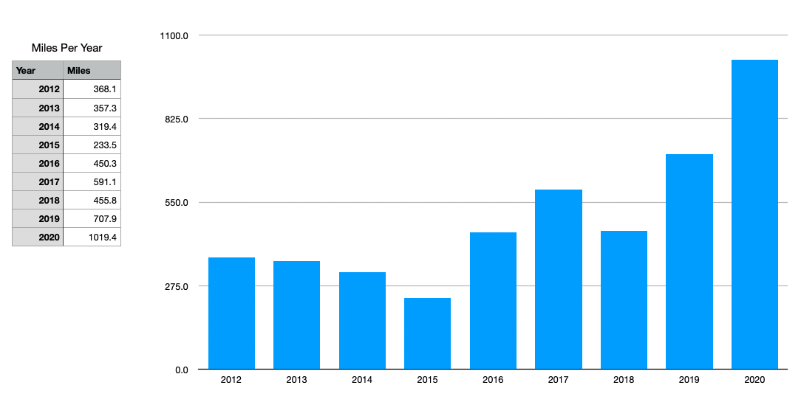
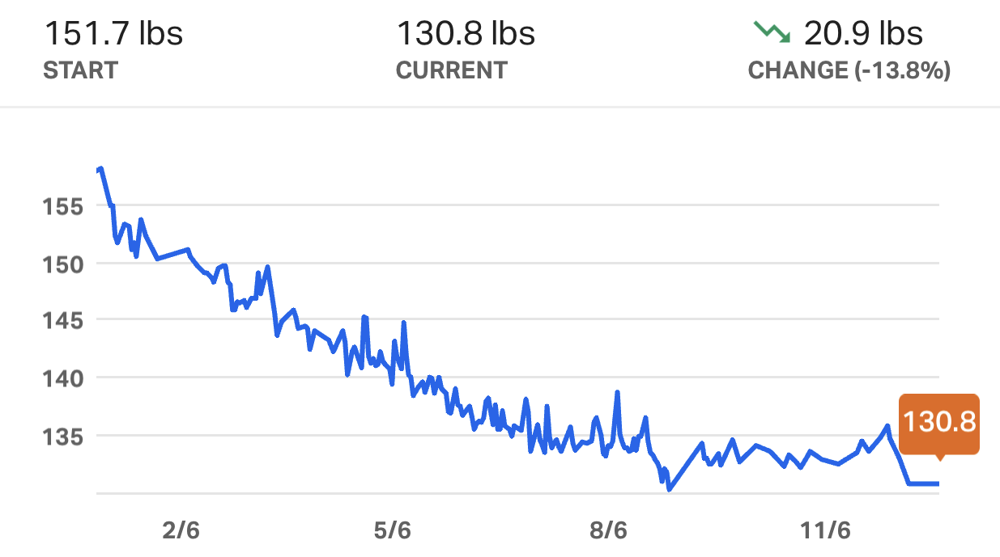
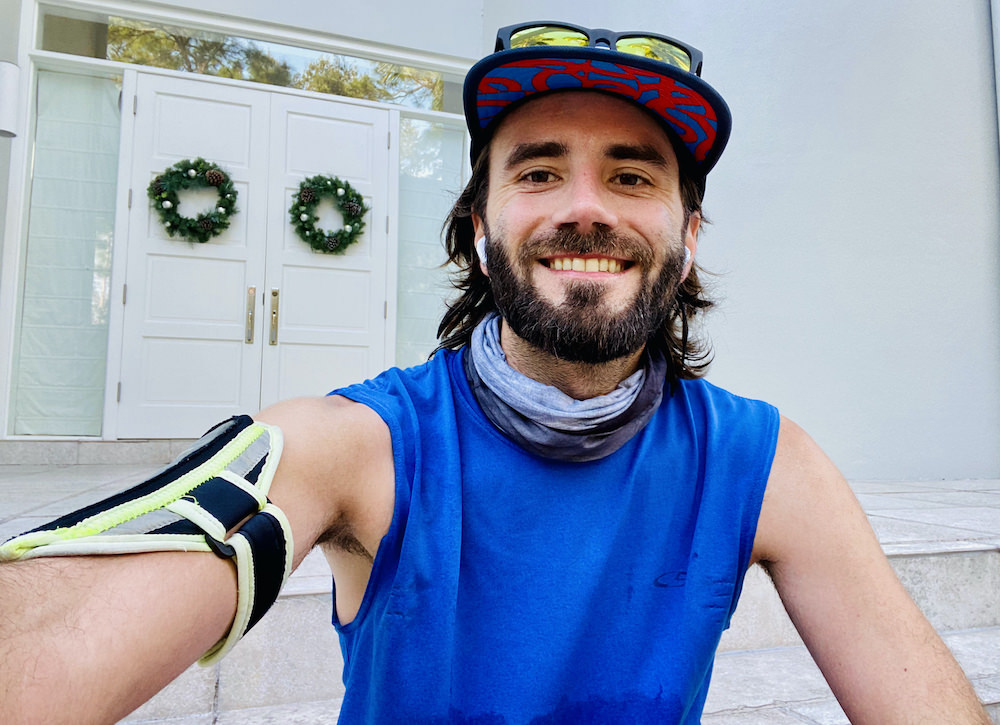

In 2020, I achieved my goal of running over 1,000 miles in the calendar year. On the cusp of the achievement, I started to ask myself what it all meant. What was all of this running for? As it became clear I was going to reach and surpass the milestone &#8212; free of injury, ahead of schedule, and generally optimistic &#8212; I felt a pressing need to explore my purpose behind the miles. By writing this post, I hope to understand myself and inspire others to pursue their goals of any kind.

## Setting the 1,000 Mile Goal
In January 2020, a friend asked if I had any New Year's resolutions. I told her I wanted to run 1,000 miles before the year's end without giving it much thought beforehand. Just like that, I challenged myself on the spot at a burger joint in Echo Park, and I let that seed grow over the next few days until it crystallized into a formal goal.

Usually, I'm not one to make resolutions because, like any cold turkey/dieting trends, I find them psychologically unsustainable. Instead, I've preferred small changes that I can sustain over a lifetime. But as I've grown older, I've realized that sometimes one must set ambitious goals to achieve significant growth. Goals that take a full year to accomplish don't bring about radical, instantaneous change. While quick fixes sound enticing, a full year of hard work will do more to burn best practices into your psyche.

## Achieving Big Goals in 2020
Like everyone else in the world, 2020 did not go as planned for me. I feel for folks who have lost their businesses and jobs, and I'm fortunate that I still have a stable gig. That said, I took a big financial hit in 2020, and I know I'm not alone.

> You can't outrun your demons, but you can attack them.

Given the unfortunate circumstances of isolating lockdowns, financial hardship, and divisive politics, how could I stay motivated to achieve my lofty running goal? To quote the "Toughest Man Alive," [David Goggins](https://www.instagram.com/davidgoggins/), "you can't outrun your demons, but you can _attack them_." That phrase summarizes how I dealt with 2020; I couldn't control most of the unfavorable conditions around me, but I could ground myself by attacking my running goal.

## My Running History
I used to hate running. I grew up in Southwest Florida, and the humidity generally kept me inside, where I was nerding out on music. That all changed when I moved to Los Angeles in 2010 and was inspired to explore the city on foot. Living in Silver Lake, I spent considerable time in Griffith Park, the LA River, and various trails.

Since I moved to California, I've run 3 full marathons, 10 half marathons, and a handful of 5/10k races. My best full marathon time is 3:43 (LA in 2020). That's a pace of 8:29 per mile for 26.2 miles. While that time doesn't qualify for the Boston Marathon, I'm proud of how much I've improved over the past 8 years.

For those doing the math, 1,000 miles in a year isn't a crazy amount of miles. If you ran 2.8 miles every day of the year, you would easily achieve the same goal. The real challenge is getting out there and staying healthy/motivated for 52 weeks. The best I could do in any previous year was about 700 miles. And there's a reason for that; I've injured myself every year for the last 8 years by increasing my mileage too quickly. So, I knew I had to take a new approach if I was going to run 43% more miles than in my previous year.

## Injuries
In the past decade, I've suffered some type of running injury nearly every year: Plantar fasciitis, knee pain, IT band pain, calf strains, back pain, and more. All of this was a result of pushing too hard, too fast. Even in my mid-twenties, my body routinely told me it was not okay with how quickly I expected it to adapt to rapid increases in mileage.

## Strategy
To overcome this, I worked with a physical therapist, elite runner, and overall rad dude, [Jordan Perry](https://www.fitrightphysicaltherapy.com/), to devise a strategy of ramping up mileage.

### 📈 Consistently run more miles each month.
When I first met Jordan in 2019, he pointed out how inconsistent my numbers were. I would run a bunch of miles leading up to a race and then rest for several months after. He told me I need to start averaging at least 70 miles each month for a full year. By January 2020, I had several consecutive months above that minimum.

### 🏋 Ditch stretches, do dynamic warmups.
Replace static stretching with dynamic warmups. I did over 5,000 walking lunges this year before my runs. I swung my legs back and forth. I did un-weighted quats. I did butt-kicks and high knees. I stopped stretching. I stopped rolling. I felt better AND maintained flexibility.

_If this seems crazy to you, take a gander at this article on [the case against stretching](https://www.outsideonline.com/2408467/case-against-stretching-flexibility-research)._

### ⚖️ Focus on Body Mass Index (BMI).
As a by-product of the increase in mileage (and cooking at home due to Covid), I lost about 30 pounds and reduced my body fat to about 10-11%. As I had done in previous training cycles, I tracked my caloric intake with MyFitnessPal until I reached my goal weight.

But the real trick was getting my BMI (Body Mass Index) down to 19. I bought a smart scale from [Greater Goods](https://greatergoods.com/), tracked my body fat, and monitored my caloric intake to reduce weight. Once I reached it, my runs became easier and faster. I'm intimately aware that dieting and endurance running are diametrically opposed forces. Therefore, one must lose weight only while realizing benefits in performance. This takes some time, but in the end, it's worthwhile.

### Fuel the body for runs
Running wouldn't be any fun if I felt gassed during or after each run. To avoid that, I make sure to feed my body properly. From a macronutrient perspective, I strive to get most of my calories from carbs and protein. Luckily for me, I'm comfortable eating roughly the same meal almost every day. That generally looks like:
- Kashi GoLean cereal in the morning
- Turkey or ham sandwich at lunch
- Protein & rice bowl at dinner
- Rx Bar for a snack

To prepare for runs, I take advantage of my recurring subscription of GU Energy Gels. I take one of those before every run to make sure I have gas in the tank. And if I'm going out for a run above 9-10 miles, I'll also prep with a glass of CarboPro &#8212; which is exactly what it sounds like.

## Motivation During Runs
Here are some tactics I used to keep my feet moving in the middle of runs:

### ➡️ Attack the negatives
We all have stuff that holds us back and embarrasses us. Use the meditative nature of running to shed that negativity. Negativity keeps me from putting on my running shoes, but once I take my first step, I start to either process or escape the uglier parts of life.

### ➡️ Spring each step with the positives
When you're having a good day, your run should be faster. Challenge yourself that day because you have extra energy that you can leave on the trails.

### ➡️ Entertain yourself and learn
Use your headphones and use your time to learn. In 2020, I rekindled my interest in podcasts. One particularly engaging series for me has been [The Lex Fridman Podcast](https://lexfridman.com/podcast/).

## Non-Covid Obstacles in 2020
- I had some significant ankle pain in the summer. When it wouldn't subside, I took about a week off and brought up the mileage slowly. I was previously ahead of schedule and then had miles to make up.
- I traveled 4 times in the last 4 months of 2020 alone. It can be really tough to get runs in while on the road (or in the air), but I made it happen.
- I routinely feel exhausted because I'm not the best sleeper. There were days I really didn't feel like running but got out there anyway.

## 🏁 Crossing The Finish Line
I began to wonder what I would even feel when I achieved my goal. Should I feel relief? Pure joy and ecstasy? A burst of celebratory tears after a challenging year?

**Here's what actually happened:** As soon as I set out for my 4-mile run that would push me beyond the threshold, I felt like I could do _anything_. Feelings of self-doubt melted away, and I felt overwhelming positive energy. That feeling alone was worth each of the previous 996 miles. When I finished, I smiled, sat down on the front porch, and began thinking about what would come next.

## What's Next
In 2021, I plan to build on my success and run 1,200 miles this year. To improve and stay injury-free, I need to:
- Continue to listen to my body. Stay away from the pain.
- Set one day a week aside for cross-training.
- Maintain my current weight.

Here's to continually challenging oneself and celebrating the wins. 🍻
